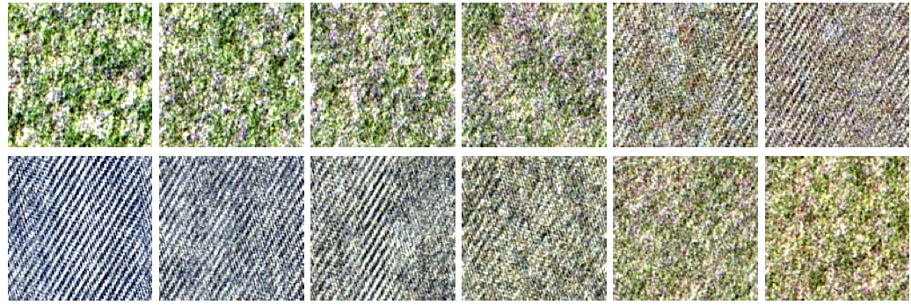

This Matlab package contains the source code to reproduce the figure of the article:

G-S. Xia, S. Ferradans, G. Peyré, J-F. Aujol. [Synthesizing and Mixing Stationary Gaussian Texture Models](https://hal.archives-ouvertes.fr/hal-00816342/). SIAM Journal on Imaging Sciences, 7(1), pp. 476–508, 2014.

* data/:  all the data needed to reproduce the results in the paper;
* results/: all the results
* code_core/: the main codes for computing
    - SN-/AR-dyntextons (dyntextons),
    - OT-geodesic of SN-/AR texture models (geodesic),
    - OT-barycenter of SN-/AR texture models (barycenter)
* demo: demos for re-producing all the results in the paper

In the "Supplemental materials.ppt" file (Microsoft PowerPoint): There are videos for results on dynamic textures,please SHOW the slides to see the VIDEOS.

Copyright (c) 2013 G-S. Xia, S. Ferradans, G. Peyré, J-F. Aujol
